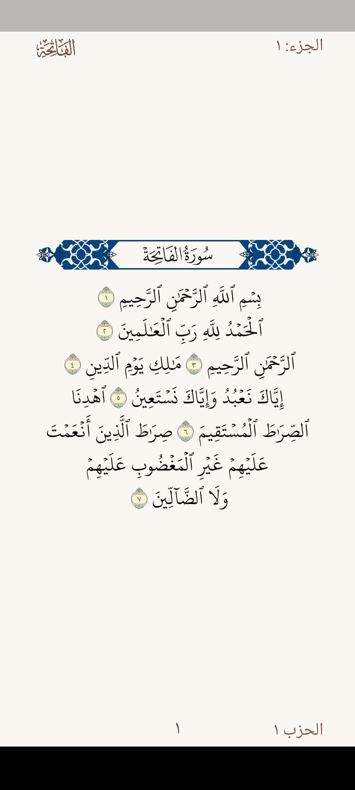
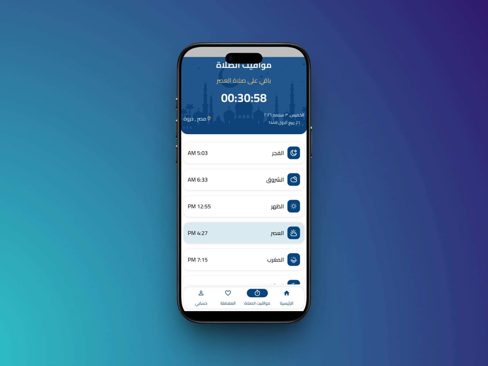
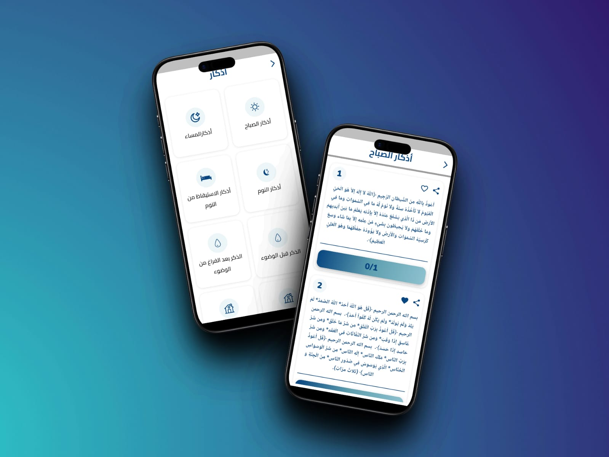
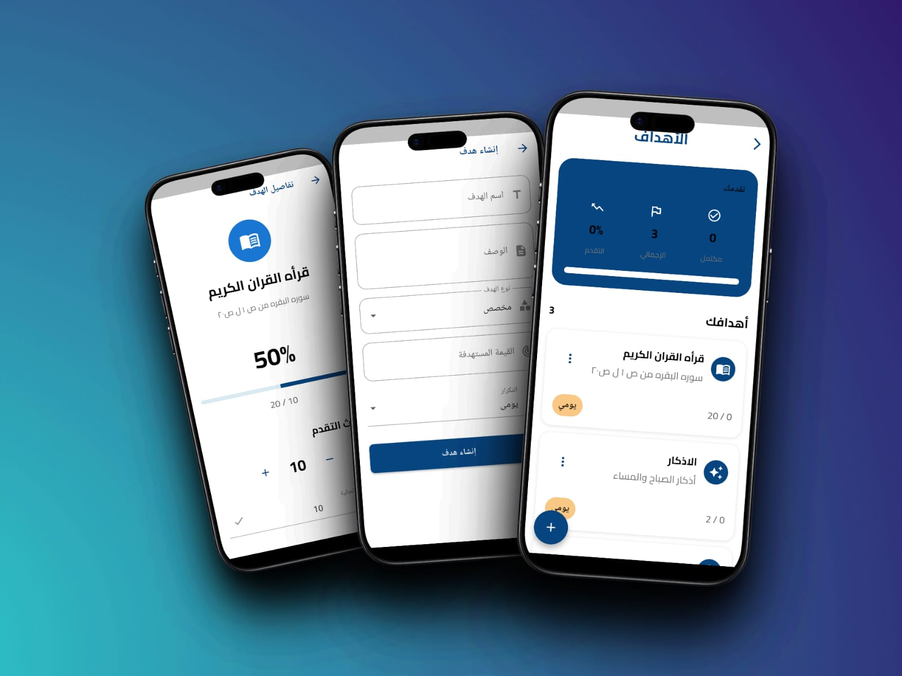
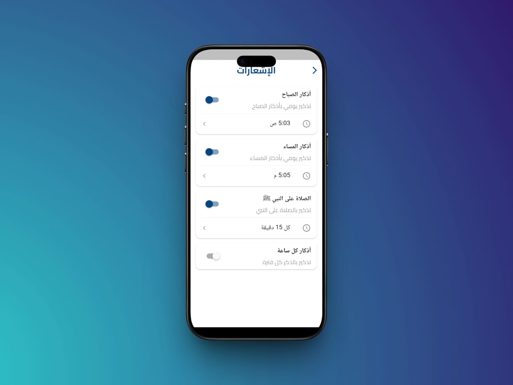
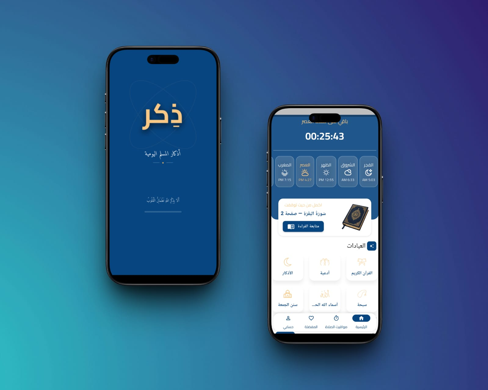
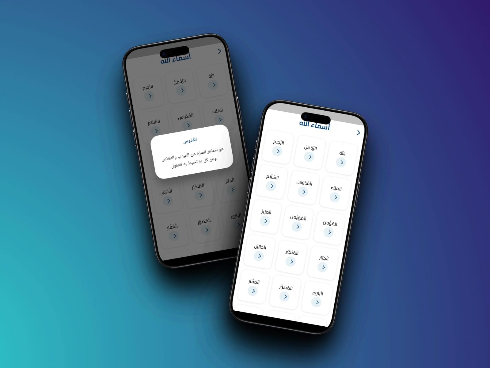
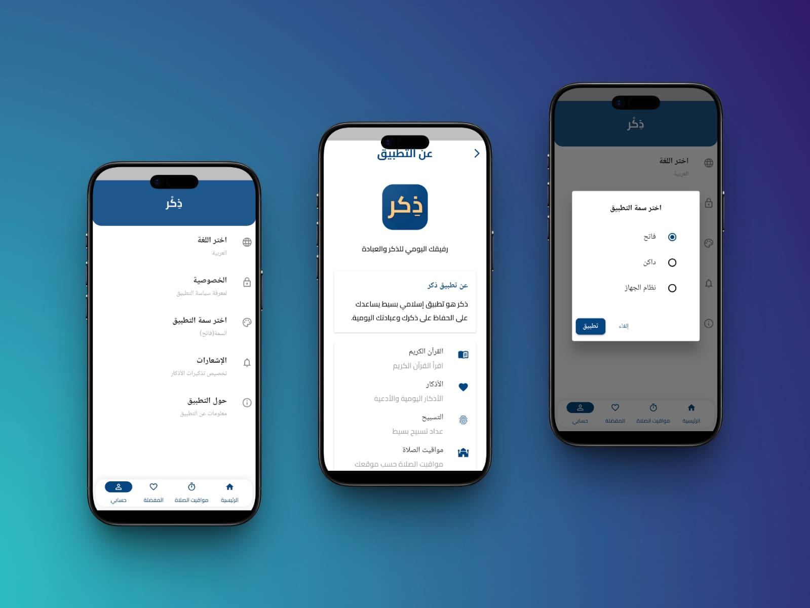
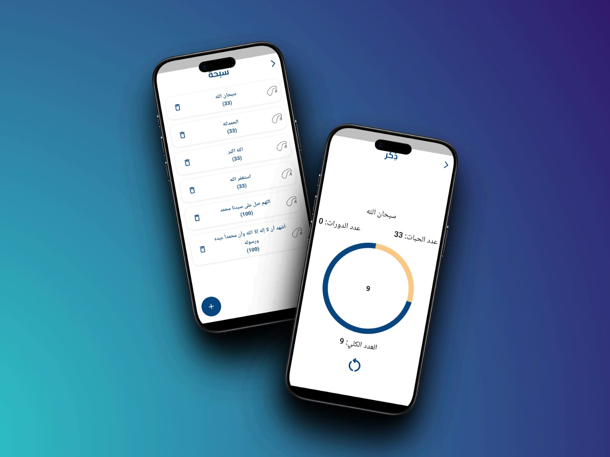
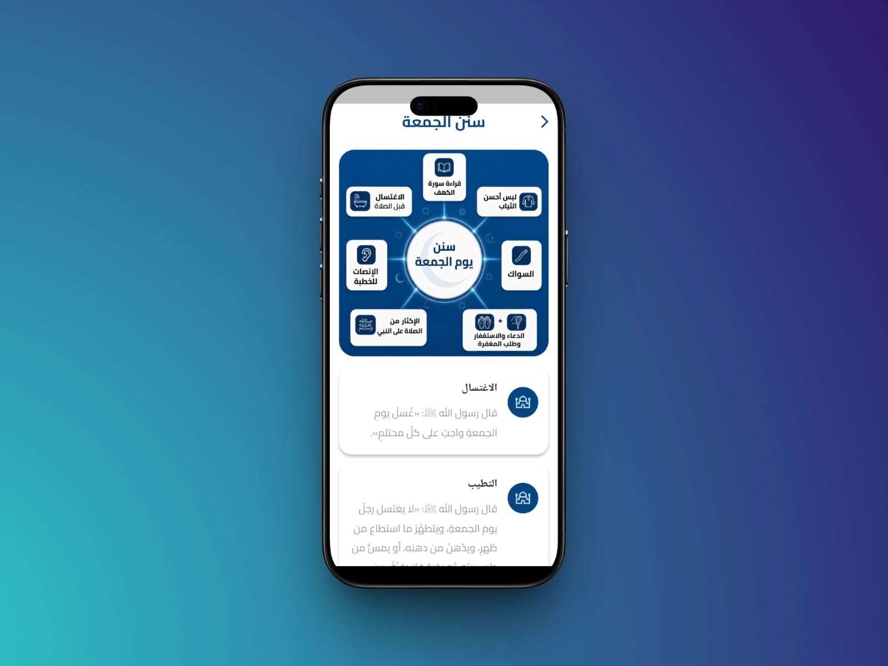

# ذِكر (Zker) 🕌

**ذِكر** is an Islamic Flutter application designed to help users stay
connected with the Quran, Azkar, Duas, prayer times, and daily spiritual
goals through a simple and modern interface.

## 🎥 Demo Video

> **Watch the full demo:**\
> [▶️ Open Zker Demo Video](assets/demo/demo.mp4)

------------------------------------------------------------------------

## 📱 Screenshots

### Quran



### Prayer Times



### Azkar



### Goals



### Notifications



### Home



### Allah's Names



### Profile



### Tasbeeh



### Sunnah



------------------------------------------------------------------------

## ✨ Features

-   📖 **Quran**
    -   Read the Holy Quran.
    -   Easy and clean reading experience.
-   🤲 **Azkar**
    -   Morning and evening Azkar.
    -   Different Azkar categories.
    -   Track your progress while reading.
-   💭 **Duas**
    -   Collection of Islamic supplications.
-   📿 **Tasbeeh**
    -   Digital Tasbeeh counter.
    -   Simple interface for daily remembrance.
-   🕋 **Prayer Times**
    -   Display daily prayer times.
    -   Prayer-related reminders and notifications.
-   🎯 **Daily Goals**
    -   Create and track spiritual goals.
    -   Monitor your daily progress.
-   🔔 **Notifications**
    -   Morning Azkar reminders.
    -   Evening Azkar reminders.
    -   Prophet ﷺ remembrance reminders.
    -   Hourly Azkar reminders.
    -   Customizable reminder times.
-   🌙 **Names of Allah**
    -   Explore the beautiful Names of Allah.
-   🌐 **Localization**
    -   Arabic-friendly interface and localization support.
-   👤 **Profile**
    -   User profile and personal settings.

------------------------------------------------------------------------

## 🏗️ Project Architecture

The project follows **Clean Architecture** with a feature-first
structure.


### Main Structure

``` text
lib/
├── core/
│   ├── constants/
│   ├── errors/
│   ├── routes/
│   ├── services/
│   ├── utils/
│   └── widgets/
│
├── features/
│   ├── azkar_feature/
│   ├── favourite/
│   ├── friday_sunnah_feature/
│   ├── goals_feature/
│   ├── home_feature/
│   ├── notifications/
│   ├── profile_feature/
│   ├── quran_feature/
│   ├── spha_feature/
│   └── ...
│
├── l10n/
├── main.dart
└── ...
```

Each feature is organized into layers such as:

``` text
feature/
├── data/
│   ├── datasources/
│   ├── models/
│   └── repositories/
│
├── domain/
│   ├── entities/
│   ├── repositories/
│   └── usecases/
│
└── presentation/
    ├── cubit/
    ├── views/
    └── widgets/
```

------------------------------------------------------------------------

## 🛠️ Tech Stack

-   **Flutter / Dart**
-   **Cubit / Flutter Bloc**
-   **Clean Architecture**
-   **Feature-First Architecture**
-   **GetIt** for Dependency Injection
-   **Hive** for local storage
-   **Firebase** services where required
-   **GoRouter** for navigation
-   **Dio** for API communication
-   **Flutter Local Notifications**
-   **Timezone** support
-   **Localization (l10n)**

------------------------------------------------------------------------

## 📂 Assets

Application screenshots are available in:

``` text
assets/
└── screenshots/
    ├── azkar.jpeg
    ├── goals.jpeg
    ├── home.jpeg
    ├── name_of_alla.jpeg
    ├── notification.jpeg
    ├── prayer_time.jpeg
    ├── profile.jpeg
    ├── quran.jpeg
    ├── spha.jpeg
    └── sunha.jpeg
```

------------------------------------------------------------------------

## 🚀 Getting Started

### 1. Clone the repository

``` bash
git clone <repository-url>
cd zker
```

### 2. Install dependencies

``` bash
flutter pub get
```

### 3. Run the application

``` bash
flutter run
```

------------------------------------------------------------------------

## 👩‍💻 Developer

Developed as a Flutter Islamic application project with a focus on clean
architecture, reusable components, and a simple user experience.
